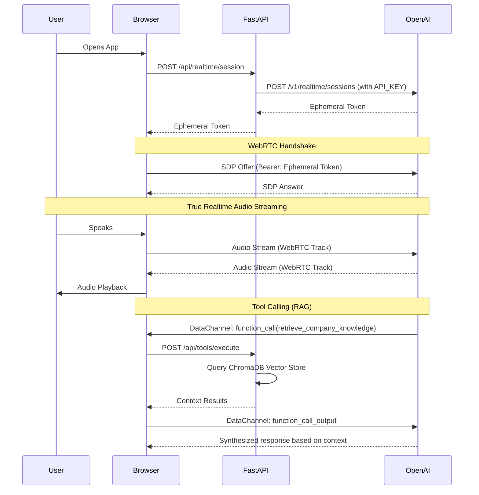

# Architecture: Realtime WebRTC Voice Agent

## System Diagram

## Why Ephemeral Tokens?
Connecting directly to OpenAI's WebRTC endpoints requires an API Key. If we put our standard `OPENAI_API_KEY` in the browser, any user could steal it.
The Ephemeral Token is a temporary credential generated by our backend. It dictates exact restrictions (voice, system prompt, allowed tools) and expires quickly. 

## VAD (Voice Activity Detection)
We utilize OpenAI's `server_vad` configuration. When the AI is speaking and the user interrupts, OpenAI's edge servers immediately detect the human voice, halt the TTS generation, and send a `response.cancel` event down the WebRTC data channel. The frontend does not need manual volume thresholds.
